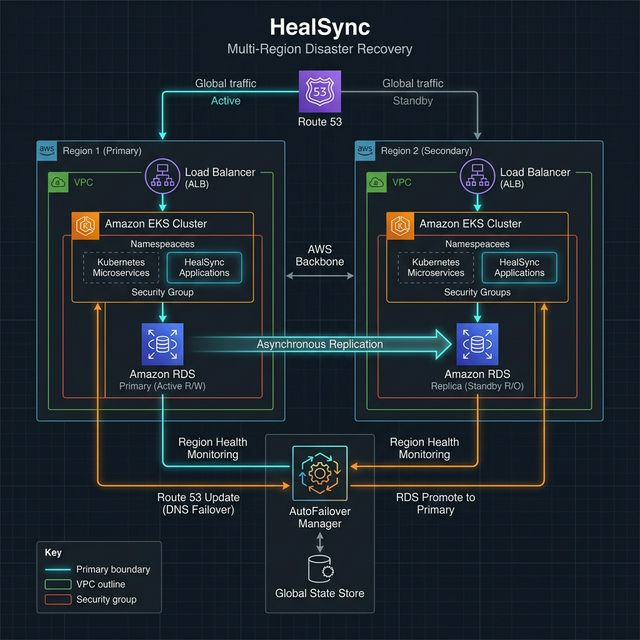

# HealSync: AWS Multi-Region (Primary + Secondary)




Production-style Disaster Recovery (HealSync) app with:

- Flask API + dashboard
- MySQL primary/secondary with replication checks
- Auto failover/failback logic in app
- Kubernetes manifests for VM testing
- Terraform infra for AWS primary (`us-east-1`) + AWS secondary (`ap-south-1`)

## 🚀 What This System Does

- 🟢 Writes go to the active database (`primary` by default).
- 🔁 If primary fails, app switches to `secondary`.
- ✅ `POST /api/todos` returns replication confirmation (`replicated_to_secondary`).
- 🛡️ Strict mode can reject writes (`503`) if secondary confirmation is not received in time.

## 🧱 Repository Structure

```text
healsync/
├── app/                       # Flask app
├── k8s/                       # Kubernetes manifests
├── terraform/                 # AWS multi-region infra
├── lambda/                    # AWS failover health-check lambda
├── COMMANDS_ALL_IN_ONE.md     # Step-by-step run commands
```

### Emoji View

```text
👤 User
  |
  v
🌐 Route53 (app domain)
  |
  v
🧩 Flask App (Docker/K8s)
  |
  +--> 🗄️ Primary MySQL (write target by default)
  |         |
  |         +--> 🔄 Replication --> 🗄️ Secondary MySQL
  |
  +--> 🧠 AutoFailover Manager
            |
            +--> switches active_db to secondary on failure
            +--> exposes /api/status and /api/replication

☁️ AWS Region 1 (us-east-1): Primary EKS + Primary RDS stack
☁️ AWS Region 2 (ap-south-1): Secondary EKS + Secondary RDS stack
```

## ⚙️ Core Runtime Features

- `GET /api/status` -> active DB, health, state machine status.
- `GET /api/replication` -> replication health details from secondary.
- `POST /api/todos` -> write todo + replication check result.
- `POST /api/failover` -> manual failover.
- `POST /api/failback` -> manual failback.

Health endpoints:

- `GET /live` -> liveness
- `GET /ready` -> readiness
- `GET /health` -> backward-compatible summary

## 🔐 Replication Strict Mode

Config in `app/config.py` and `k8s/flask/configmap.yaml`:

- `WAIT_FOR_REPLICATION=true|false`
- `REPLICATION_STRICT_ACK=true|false`
- `REPLICATION_WAIT_TIMEOUT_SECONDS` (default `5`)
- `REPLICATION_POLL_INTERVAL_SECONDS` (default `0.2`)

When `REPLICATION_STRICT_ACK=true`:

- If write is committed on primary but not confirmed on secondary before timeout, API returns `503`.

## 🐳 Local Testing (Recommended First)

Use:

- [COMMANDS_ALL_IN_ONE.md](COMMANDS_ALL_IN_ONE.md)

## ☸️ Kubernetes Testing (2-Node VM)

Use:

- [COMMANDS_ALL_IN_ONE.md](COMMANDS_ALL_IN_ONE.md)

NodePort for VM test:

- `http://<node-ip>:30080`

## ☁️ Terraform Multi-Region (AWS -> AWS)

Current target regions:

- Primary: `us-east-1`
- Secondary: `ap-south-1`

Key Terraform variables:

- `aws_region`
- `aws_secondary_region`
- `aws_vpc_cidr`
- `aws_secondary_vpc_cidr`
- `eks_cluster_name`
- `eks_secondary_cluster_name`
- `rds_instance_class`
- `rds_secondary_instance_class`

Example file:

- [terraform/terraform.tfvars.example](terraform/terraform.tfvars.example)

## 🧪 Validation Checklist

1. `GET /api/status` shows expected `active_db`.
2. `GET /api/replication` shows healthy replication.
3. `POST /api/todos` returns `replicated_to_secondary: true` in healthy state.
4. Stop primary and confirm switch to `secondary`.
5. Writes continue during failover.

## 📌 Notes

- App failover state is in-process memory. For deterministic behavior during tests, avoid multiple independent app processes with unsynchronized state.
- MySQL replication must be configured and healthy for mirrored data behavior.

## ✍️ Author

- **Amul Thantharate** — _Cloud DevOps Engineer_
- [Contributor List](CONTRIBUTING.md)
